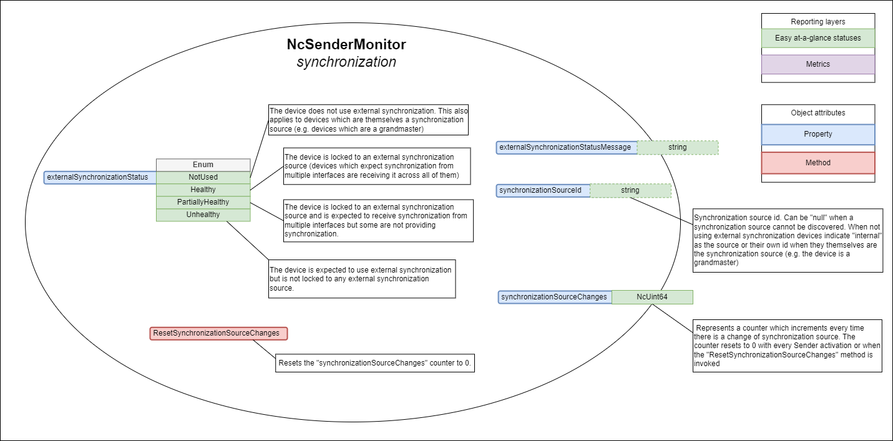

# AMWA BCP-008-02: NMOS Sender Status
{:.no_toc}

* A markdown unordered list which will be replaced with the ToC, excluding the "Contents header" from above
{:toc}

_(c) AMWA 2021, CC Attribution-NoDerivatives 4.0 International (CC BY-ND 4.0)_


## Introduction

Alarms are context and workflow specific, and in general determined by a higher level monitoring system, with different calculations for different users. For example, a hardware error status (such as link down) from a device not actively being used would not cause an alarm to a live workflow operator, but the same status condition would escalate an alarm to a maintenance engineer who needs to prepare that device for future operational use.

This BCP document does not attempt to define alarms but instead it describes the expectations, behavior and conformance requirements for Devices with stream Senders in terms of status monitoring.

The [overall status](#sender-overall-status) concepts defined in this document are intended to make it easy to calculate a typical operator alarm condition. In simple systems with no higher level monitoring system, the `overallStatus` can be used directly as a simple pre-defined non-configurable operator alarm condition, without in any way limiting a monitoring system's ability to take the same status values and calculate one or more different alarm conditions appropriate to other desired workflows or users.

This document relies on previous familiarity with the following existing documents:

* [NMOS Control Framework](https://specs.amwa.tv/ms-05-02/)
* [NMOS Control Protocol](https://specs.amwa.tv/is-12/)
* [NMOS Discovery and Registration](https://specs.amwa.tv/is-04/)
* [NMOS Device Connection Management](https://specs.amwa.tv/is-05/)

The technical models referenced in this document are fully published in the [Monitoring NMOS Control Feature Set](https://specs.amwa.tv/nmos-control-feature-sets/branches/publish-status-reporting/monitoring/).

The following domains are covered in terms of status monitoring with specific sections for each:

* [Sender connectivity](#sender-connectivity)
* [Sender synchronization](#sender-synchronization)
* [Sender essence validation](#sender-essence-validation)

## Use of Normative Language

The key words "MUST", "MUST NOT", "REQUIRED", "SHALL", "SHALL NOT", "SHOULD", "SHOULD NOT", "RECOMMENDED", "MAY",
and "OPTIONAL" in this document are to be interpreted as described in [RFC-2119](https://datatracker.ietf.org/doc/html/rfc2119).

## Definitions

The NMOS terms 'Controller', 'Node', 'Source', 'Flow', 'Sender', 'Receiver' are used as defined in the [NMOS Glossary](https://specs.amwa.tv/nmos/main/docs/Glossary.html).

Sender activation - An [IS-05 activation](https://specs.amwa.tv/is-05/latest/docs/Interoperability_-_IS-04.html#identifying-active-connections) which results in the Sender having the required transport parameters and a `master_enable` status of `true`. This can happen for an idle sender but also when the sender is already activated and a client is applying new transport parameters.

## Prerequisites

Devices in conformance to this BCP MUST use [NMOS Control Framework](https://specs.amwa.tv/ms-05-02/) for generating device models.  
Devices in conformance to this BCP MUST use [NMOS Control Protocol](https://specs.amwa.tv/is-12/) to expose device models via a standard API with full support for notifications.  
Devices in conformance to this BCP MUST use [NMOS Discovery and Registration](https://specs.amwa.tv/is-04/) to create and register Nodes, Devices and Sender resources.  
Devices in conformance to this BCP MUST use [NMOS Device Connection Management](https://specs.amwa.tv/is-05/) to perform connection management actions against Sender resources.  

## Sender monitoring

The technical model describing the monitoring requirements for a sender is [NcSenderMonitor](https://specs.amwa.tv/nmos-control-feature-sets/branches/publish-status-reporting/monitoring/#ncsendermonitor).

This model MUST inherit from the baseline status monitoring model [NcStatusMonitor](https://specs.amwa.tv/nmos-control-feature-sets/branches/publish-status-reporting/monitoring/#ncstatusmonitor).

The proposed models are minimal and they can be implemented as is or derived in [vendor specific variants](https://specs.amwa.tv/ms-05-02/latest/docs/Introduction.html) which can add more statuses, properties and methods.

|  |
|:--:|
| _**Sender monitoring model**_ |

The `statusReportingDelay` property allows clients to customize the reporting delay used by devices to report statuses. Devices MUST use 3s as the default value. All domain specific statuses are impacted by the configured `statusReportingDelay` as follows:

* A sender is expected to go through a period of instability upon activation. Therefore, on Sender activation domain specific statuses offering an `Inactive` option MUST transition immediately to the Healthy state. Furthermore, after activation they MUST delay the reporting of non Healthy states for the duration specified by `statusReportingDelay`, as long as the Sender isn't being [deactivated](#deactivating-a-sender), and then transition to any other appropriate state.

* Once any Sender activation `statusReportingDelay` has elapsed and the Sender isn't being [deactivated](#deactivating-a-sender), all domain specific statuses MUST delay the transition to a more healthy state by the configured `statusReportingDelay` value and MUST only make the transition if the healthier state is maintained for the duration. All domain specific statuses MUST make a transition to a less healthy state as soon as possible.

### Sender overall status

The purpose of the overallStatus is to abstract and combine the specific domain statuses of a monitor into a single status which can be more easily observed and displayed by a simple client.

`Note`: The overallStatus might remain the same even when specific domain statuses change but the overallStatusMessage might change because a different combination of internal states is causing the current overallStatus value.

Devices MUST follow the rules listed below when mapping specific domain statuses in the combined overallStatus:

* When the Sender is Inactive the overallStatus uses the Inactive option
* When the Sender is Active the overallStatus takes the worst state across the different domains (if one status is PartiallyHealthy (or equivalent) and another is Unhealthy (or equivalent) then the overallStatus would be Unhealthy)
* The overallStatus is Healthy only when all domain statuses are either Healthy or a neutral state (e.g. Not used)

### Sender connectivity

The technical model describing the monitoring requirements for a sender is [NcSenderMonitor](https://specs.amwa.tv/nmos-control-feature-sets/branches/publish-status-reporting/monitoring/#ncsendermonitor).  
This includes the following specific items which cover the connectivity domain:

* Properties
  * linkStatus
  * linkStatusMessage
  * transmissionStatus
  * transmissionStatusMessage
  * autoResetPacketCounters
* Methods
  * GetLostPackets
  * GetLatePackets
  * ResetPacketCounters

|  |
|:--:|
| _**Sender connectivity (explanatory notes are informative)**_ |

#### Link status

The linkStatus property allows devices to expose the health of all the physical links associated with the sender.

Devices specify if:

* All of the interfaces are Up (equivalent to a Healthy state)
* Some of the interfaces are Down (equivalent to a PartiallyHealthy state)
* All interfaces are Down (equivalent to an Unhealthy state)

The linkStatusMessage is a nullable property where devices can offer the reason and further details as to why the current status value was chosen.

Devices are RECOMMENDED to publish information about which interfaces are down in the linkStatusMessage.

Example:

```log
NIC1, NIC2 are down
```

#### Transmission status

The transmissionStatus property allows devices to expose the health of the sender with regards to transmitting a stream successfully. Other connection problems like 802.1x authorization, DHCP and other causes are also reflected in the transmissionStatus.

Devices specify:

* When the sender is Inactive (is a neutral state)
* Healthy when the sender is Active and transmitting the stream successfully without any detected errors
* PartiallyHealthy when the sender is Active and transmitting the stream successfully whilst detecting recoverable errors
* Unhealthy when the sender is Active and transmitting the stream successfully whilst detecting unrecoverable errors

The transmissionStatusMessage is a nullable property where devices can offer the reason and further details as to why the current status value was chosen.

#### Late and lost packets

The sender monitoring model provides means of gathering metrics around late and lost packets. These are not statuses but instead enable further analysis when [link status](#link-status) or [transmission status](#transmission-status) indicate problems (are PartiallyHealthy or Unhealthy).

The feature is expressed with the following methods:

* GetLostPacketCounters - returns a collection of counters which hold the name and numeric value of the counter (this allows more capable devices to report lost packets across different interfaces).
* GetLatePacketCounters - returns a collection of counters which hold the name and numeric value of the counter (this allows more capable devices to report late packets across different interfaces).
* ResetPacketCounters - allows a client application to reset both the Lost and Late packet counters to 0.

The `autoResetPacketCounters` property allows clients to configure if the packet counters automatically reset with each Sender activation (by default devices MUST have this enabled). If this is enabled, senders MUST reset all packet counters to 0 after each activation.

### Sender synchronization

The technical model describing the monitoring requirements for a sender is [NcSenderMonitor](https://specs.amwa.tv/nmos-control-feature-sets/branches/publish-status-reporting/monitoring/#ncsendermonitor).  
This includes the following specific items which cover the synchronization domain:

* Properties
  * externalSynchronizationStatus
  * externalSynchronizationStatusMessage
  * synchronizationSourceId
  * synchronizationSourceChanges
* Methods
  * ResetSynchronizationSourceChanges

|  |
|:--:|
| _**Sender synchronization (explanatory notes are informative)**_ |

#### External synchronization status

The externalSynchronizationStatus property allows devices to expose the health of the sender with regards to its time synchronization mechanisms.

Devices MUST specify:

* Not used - when the sender is not using external synchronization or when the device is itself the synchronization source (this is a neutral state)
* Healthy - when the sender is locked to an external synchronization source (devices which expect synchronization from multiple interfaces are receiving it across all of them)
* Partially healthy - when the sender is locked to an external synchronization source and is expected to receive synchronization from multiple interfaces but some are not providing synchronization (Senders MUST also temporarily transition to this state when detecting a synchronization source change)
* Unhealthy - when the sender is expected to use external synchronization but is not locked to any external synchronization source

The externalSynchronizationStatusMessage is a nullable property where devices can offer the reason and further details as to why the current status value was chosen.

Devices are recommended to publish information about the previous synchronization source and interface retrieved from as well as the current synchronization source and interface retrieved from in the externalSynchronizationStatusMessage.

Devices are RECOMMENDED to publish in the `externalSynchronizationStatusMessage` property information about the previous synchronization source and originating interface as well as the current synchronization source and its originating interface.

Example:

```log
previousSync:baseband from SDI1, currentSync: 0x00:0c:ec:ff:fe:0a:2b:a1 from NIC1
```

or

```log
previousSync:0x70:35:09:ff:fe:c7:da:00 from NIC1, currentSync: 0x00:0c:ec:ff:fe:0a:2b:a1 from NIC2
```

#### Synchronization source change

When devices are configured to use external synchronization they MUST publish the synchronization source id currently being used and update the `externalSynchronizationStatus` property whenever it changes, using `null` if a synchronization source cannot be discovered. Devices which are not using external synchronization MUST populate this property with `internal` or their own id if they themselves are the synchronization source (e.g. the device is a grandmaster).

When devices suffer a synchronization source change the `externalSynchronizationStatus` property MUST temporarily transition to a `PartiallyUnhealthy` state. It can then return to a different state if the operating conditions match it more closely (returning to a healthier state MUST respect the configured `statusReportingDelay` property).

Devices MUST report any synchronization source change as an increment to the `synchronizationSourceChanges` counter property.

Devices MUST be able to reset the `synchronizationSourceChanges` counter property in the following two ways:

* When a sender activation occurs
* When a client invokes the `ResetSynchronizationSourceChanges` method

### Sender essence validation

The technical model describing the monitoring requirements for a sender is [NcSenderMonitor](https://specs.amwa.tv/nmos-control-feature-sets/branches/publish-status-reporting/monitoring/#ncsendermonitor).  
This includes the following specific items which cover the essence validation domain:

* Properties
  * essenceStatus
  * essenceStatusMessage

|  |
|:--:|
| _**Sender essence validation (explanatory notes are informative)**_ |

#### Essence status

The essenceStatus property allows devices to expose the health of the sender with regards to the validity of the essence being transmitted.

Devices specify:

* When the sender is Inactive (is a neutral state)
* Healthy when the sender is Active and has valid essence which meets all the requirements for transmission (devices without any ability to check essence health still use Healthy if they have essence to transmit)
* PartiallyHealthy when the sender is Active and has suitable essence to transmit but it can detect errors in the validity of the essence (e.g. the device has an IP receiver feeding this sender with essence)
* Unhealthy when the sender is active and has no essence or the essence is not suitable for transmission (does not meet the expectations configured for the sender)

The streamStatusMessage is a nullable property where devices can offer the reason and further details as to why the current status value was chosen.

Examples:

```log
Unexpected format
```

```log
Parameter X does not match expectations
```

## Deactivating a sender

A Sender is deactivated after an [IS-05 activation](https://specs.amwa.tv/is-05/latest/docs/Interoperability_-_IS-04.html#identifying-active-connections) results in the Sender `master_enable` becoming `false`.

When a sender is being deactivated it MUST cleanly interrupt its transmission by not generating intermediate unhealthy states (PartiallyHealthy or Unhealthy) and instead transition directly and immediately (without being delayed by the `statusReportingDelay`) to `Inactive` for the following statuses:

* overallStatus
* transmissionStatus
* essenceStatus
